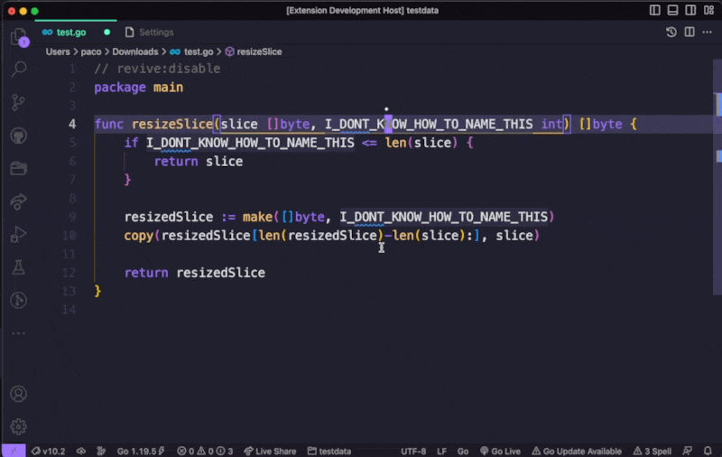

# `ai-rename` Visual Studio Code Extension

> There are only two hard things in Computer Science: cache invalidation and naming things.
> -- Phil Karlton

`ai-rename` is a Visual Studio Code extension that leverages OpenAI's API to rename the symbol under cursor.

It uses OpenAI's GPT-3 API to suggest and apply new names.

## How to use

Install it at: [vscode Marketplace](https://marketplace.visualstudio.com/items?itemName=paco0x.ai-rename)

An OpenAI API key with permissions to access the GPT-3 service is required before using. For more information on how to get a key, visit [OpenAI's website](https://openai.com/api/).

Set your OpenAI key to `aiRename.openAiApiKey"` in your vs code `settings.json` or `Open Ai Api Key` on UI:

Then, you can simply use command `"AI Rename: Rename` to generate the choices for the symbol under cursor, select an item and it'll rename it for you.

You can bind this command to any shortcuts for convenience.

See the Demo:

## Extension Settings

This extension contributes the following settings:

-   `aiRename.openAiApiKey`: the API key of OpenAI.
-   `aiRename.maxChoicesNum`: Max number of choices generated by openAI, it can quickly consume your token quota if it's too high.
-   `aiRename.maxNameLength`: Max length of generated name.
-   `aiRename.openAiTemperature`: Temperature param in openAI requests.
-   `aiRename.maxCharactersNum`: Max Number Characters of Document.

## Known Issues

-   May not provide accurate or appropriate suggestions for long functions.
-   Not accurate when the variable is too short or document contains non-ascii characters.
-   Sometimes the new name may be conflicted with the other symbol names.
-   Lack of context of the whole project.

## TODOs

-   Only send surrounding text to openAI API.
-   Unit tests

## Contributing

Feel free to contribute to the ai-rename extension by submitting bug reports, feature requests, or pull requests on the [GitHub repository](https://github.com/paco0x/vscode-ai-rename.gi).

---

**Enjoy!**
