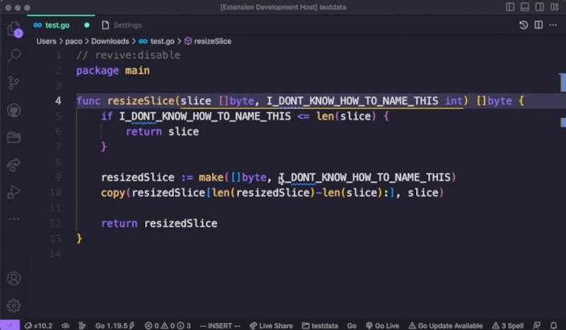

# `ai-rename` Visual Studio Code Extension

> "There are only two hard things in Computer Science: cache invalidation and naming things."
> -- Phil Karlton

`ai-rename` is a Visual Studio Code extension that uses OpenAI's API to rename the symbol under the cursor. It can provide naming suggestions and apply a new name automatically. Currently, it uses the "gpt-3.5-turbo" model, which is the same model used by ChatGPT.

## Installation

Install it from the [Visual Studio Code Marketplace](https://marketplace.visualstudio.com/items?itemName=paco0x.ai-rename).

An OpenAI API key is required before using. For more information on how to get a key, visit [OpenAI's website](https://openai.com/api/).

Set your OpenAI key to `"aiRename.openAiApiKey"` in your VS Code `settings.json` or `Open Ai Api Key` on the UI:

## Usage

Call up the command palette by pressing `cmd+shift+p` (mac) or `ctrl+shift+p` (win). Then use the command `AI Rename: Rename` to generate naming suggestions for the symbol under your cursor. Select an item and it will rename the symbol to the selected name automatically.

You can also bind this command to a shortcut for convenience.

See the demo:

## Extension Settings

This extension contributes the following settings:

-   `aiRename.openAiApiKey`: the API key of OpenAI.
-   `aiRename.maxSuggestionsNum`: the maximum number of naming suggestions generated by OpenAI; by default it's 3; it can quickly consume your token quota if it's too high.
-   `aiRename.maxNameLength`: the maximum length of the generated name.
-   `aiRename.openAiTemperature`: the temperature parameter in OpenAI requests.
-   `aiRename.maxCharactersNum`: the maximum number of characters in the document.

## Known Issues

Sometimes the renaming process may fail. This is because OpenAI's API is not stable. If you encounter this issue, please try again or adjust the temperature parameter in settings.

## To-Do List

-   Support a right-click menu item.
-   Only send surrounding text to OpenAI API.
-   Add tests.

## Contributing

Feel free to contribute to the `ai-rename` extension by submitting bug reports, feature requests, or pull requests on the [GitHub repository](https://github.com/paco0x/vscode-ai-rename.gi).

---

**Enjoy!**
